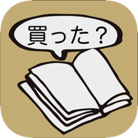

<!--
**Astoremica/Astoremica** is a ✨ _special_ ✨ repository because its `README.md` (this file) appears on your GitHub profile.

Here are some ideas to get you started:

- 🔭 I’m currently working on ...
- 🌱 I’m currently learning ...
- 👯 I’m looking to collaborate on ...
- 🤔 I’m looking for help with ...
- 💬 Ask me about ...
- 📫 How to reach me: ...
- 😄 Pronouns: ...
- ⚡ Fun fact: ...
-->

<!-- リポジトリステータス -->

<!-- ソースコード統計 -->

[Wantedly](https://www.wantedly.com/id/nayo)リンク

[Qiita](https://qiita.com/Astoremica)リンク

### リリースアプリ

- [開発経緯](https://note.com/astoremica/n/n2174cff6ac3f)
